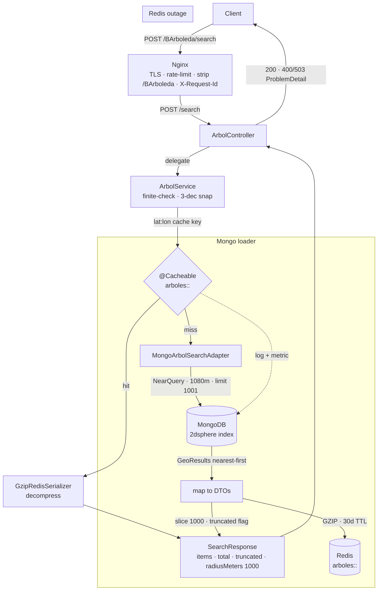
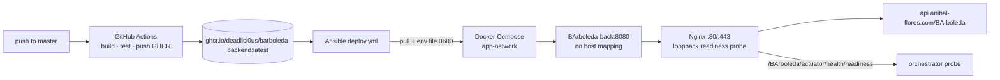

# BArboleda-backend

Geospatial tree search for Buenos Aires — a fixed-bucket, read-only API that returns the closest trees within 1000 meters of any point, backed by MongoDB's `2dsphere` index and a fail-open Redis cache.

[](https://github.com/Deadlici0us/BArboleda-backend/actions)
[](https://adoptium.net/)
[](https://spring.io/projects/spring-boot)
[](https://github.com/Deadlici0us/BArboleda-backend/pkgs)
[](#license)
[](https://api.anibal-flores.com/BArboleda/swagger-ui/index.html)
[](https://anibal-flores.com/BArboleda-Demo)

The dataset is the Buenos Aires city tree inventory, ingested out-of-band by the ETL pipeline; this service is strictly read-only.

---

## Features

| Feature | Description |
| --- | --- |
| Fixed 1000m bucket | The API always answers with the closest trees inside a fixed 1000m radius; exact client-side filtering happens on the device |
| Padded `NearQuery` | MongoDB queries a 1080m padded radius to cover the true circle despite the 3-decimal coordinate snap (~111m grid) |
| Two-tier GZIP | Payloads are GZIP-compressed in the Redis cache **and** on the HTTP wire (`Accept-Encoding: gzip`) |
| Fail-open Redis cache | `arboles::<lat:lon>` keys with 30-day TTL; on Redis outage the service degrades to Mongo, logs and meters the outage |
| Read-only discipline | The app never creates indexes; the ETL owns the `2dsphere` index; 2s timeouts bound every Mongo/Redis call |
| Observability | ECS JSON logs, `X-Request-Id` correlation, Micrometer hit/miss + Mongo latency metrics, Prometheus, split health groups |
| Hardened deployment | Layered non-root Docker image, GHCR + Ansible roll-forward/rollback, Nginx terminates TLS and rate-limits |

---

## Technical Highlights

### 1. Fixed-bucket geospatial search

Requests carry a center point (`latitude`, `longitude`). The service normalizes the center to its 3-decimal grid and answers from the **fixed 1000m bucket** — fixed so that cache keys carry no radius segment and every request near the same cell shares one `arboles::lat:lon` entry instead of fragmenting the cache.

- **Coordinate normalization:** coordinates are snapped to 3 decimals (`COORDINATE_SCALE = 3`, a ~111m grid), producing stable, canonical cache keys (`lat:lon`, `-0.0` canonicalized).
- **Padded query:** because the snapped center can shift up to ~78m (half-diagonal of the grid cell), Mongo is queried at a **1080m padded radius** (`1000 + 78`) with `.limit(1001)`.
- **Slice + truncate:** the service slices the 1001-probe to `MAX_ITEMS = 1000` and sets `truncated = true` on overflow (large parks).
- **Full-precision coordinates:** the response carries exact tree GPS (`long`/`lat`); consumers narrow the bucket down locally.

### 2. Two-tier GZIP compression

Large park searches return up to 1000 trees (~1 MB raw JSON). Two independent layers shrink the payload:

- **Cache tier** — `GzipRedisSerializer` wraps the JSON serializer with a GZIP stream before writing to Redis, cutting stored entries to a fraction of their size.
- **HTTP tier** — `server.compression.enabled=true` with `application/json` in the mime-types list; the mobile payload drops to ~90 KB over the wire.

### 3. Fail-open Redis cache

A `FailOpenCache` decorator sits in front of Spring Cache so a Redis outage can never take the API down:

- **Hit path:** `@Cacheable` on `CachedArbolSearch` resolves through the decorator; cache hit/miss counters feed Micrometer.
- **Miss path:** the loader queries Mongo, maps to DTOs, and stores the GZIP-compressed JSON with a fixed 30-day TTL.
- **Outage path:** cache down → log + metric, serve Mongo directly. Effective only because Redis timeouts are short (`connect-timeout: 2s`, `timeout: 2s`, TLS floor ~473ms measured to Upstash).
- **Readiness gates Mongo only** — a failing cache must never drain an instance; Redis health stays visible but out of the readiness group.

### 4. Read-only MongoDB discipline

- `auto-index-creation: false` — belt-and-braces; the `2dsphere` index is owned by the ETL/out-of-band infrastructure.
- Client timeouts via `MongoClientSettingsBuilderCustomizer` (`MongoConfig`): `connectTimeout` 2s, `readTimeout` 2s (driver default is infinite), `serverSelectionTimeout` 2.5s (driver default is 30s — an Atlas outage would stall every request).
- `MONGO_URI` must include the `/arbolado_db` path — a host-only URI silently uses the `admin` database.
- Boot warmup pings Mongo once so the first user request never pays cold TLS cost.

### 5. Observability

- **ECS JSON logging** via `logback-ecs-encoder` + `logback-spring.xml` (Boot 3.3 has no `logging.structured.format`, which binds only on 3.4+), with a `CorrelationIdFilter` that puts `X-Request-Id` in the MDC and echoes it in and out (generated UUID if absent).
- **Micrometer** counters for cache hit/miss (`MicrometerCache` wrapper) and Mongo command latency (driver command listener), exposed through `micrometer-registry-prometheus`.
- **Health groups:** `/actuator/health/liveness` (ping only) and `/actuator/health/readiness` (mongo, diskSpace, ping). Details never shown on the public probe.
- **ProblemDetail** (RFC 9457) error body via `GlobalExceptionHandler` — no legacy `ErrorResponse`.

### 6. Hardened deployment

- **Layered image:** multi-stage `Dockerfile` (`maven:3-eclipse-temurin-21` → `eclipse-temurin:21-jre-alpine`), `dependency:go-offline` before copying `src/` so source edits never re-download the graph; layered boot via `JarLauncher` (no nested-JAR), non-root user, `MaxRAMPercentage=75`.
- **CI/CD:** push to `master` builds and pushes `ghcr.io/deadlici0us/barboleda-backend:latest`; an Ansible playbook pulls it on the VPS, writes secrets atomically to `/opt/arbolado/BArboleda-backend.env` (mode 0600), and waits for readiness through Nginx.
- **Nginx contract:** the app serves unversioned `POST /search`; Nginx strips the `/BArboleda` prefix upstream and owns TLS, rate-limiting (scoped to search), CORS, and actuator gating. No app-level auth — explicit by design, not an omission.
- **Readiness probes** target `/BArboleda/actuator/health/readiness` via Nginx loopback; the container is published only to the compose bridge as `BArboleda-back:8080` — no host port mapping.

---

## System Architecture

The following diagram illustrates the request lifecycle, from the Nginx edge to the Redis cache and MongoDB.



Deployment topology:



---

## Project Structure

```text
BArboleda-backend/
├── src/main/java/com/barboleda/arbolado/
│   ├── ArboladoApplication.java        # @EnableCaching entry point
│   ├── config/                         # Redis cache + GZIP + fail-open + warmups + Mongo timeouts
│   ├── domain/                         # Arbol (Mongo doc), SearchRequest/Response, SearchLimits
│   ├── exception/                      # InvalidSearchRequestException, ProblemDetail handler
│   ├── service/                        # Facade, ports/adapters, cache key factory, strategies
│   └── web/                            # ArbolController (POST /search), CorrelationIdFilter
├── src/test/                           # 74 unit tests (DB-free) + *IT integration suites
├── config/checkstyle/                  # Allman braces + 120 cols + Javadoc gate
├── deploy.yml                          # Ansible playbook (VPS rollout, secrets, readiness)
├── Dockerfile                          # Layered multi-stage image, non-root JarLauncher
├── .github/workflows/deploy.yml        # Build + push to GHCR, then Ansible deploy
└── pom.xml                             # Spring Boot 3.3.13, Java 21, springdoc, micrometer
```

Key service classes:

- **`web/ArbolController`** — thin `POST /search` controller, JSON in/out, swagger annotations.
- **`service/ArbolService`** — facade: finite-check + normalize → cached search → slice + wrap.
- **`service/CachedArbolSearch`** — owns `@Cacheable`; port + mapper inside, returns ≤ 1001 DTOs.
- **`service/MongoArbolSearchAdapter`** — `MongoTemplate` + `NearQuery`, unwraps `GeoResults`.
- **`service/CacheKeyFactory`** — fixed-precision `lat:lon` keys, `-0.0` canonicalized.
- **`service/CoordinateNormalizationStrategy`** / **`RoundingNormalizationStrategy`** — strategy pair for the 3-decimal snap.
- **`config/FailOpenCache`** — sync-path fail-open decorator (outage → load direct + count).
- **`config/GzipRedisSerializer`** — GZIP stream wrapper over the JSON serializer.

---

## API Reference

Interactive documentation is available at **Swagger UI**:

- **Swagger UI:** <https://api.anibal-flores.com/BArboleda/swagger-ui/index.html>
- **OpenAPI JSON:** <https://api.anibal-flores.com/BArboleda/v3/api-docs>

| Endpoint | Method | Description | Responses |
| --- | --- | --- | --- |
| `/search` | `POST` | Trees near a center point (fixed 1000m bucket, 1080m padded Mongo query, 1000-item cap) | `200` bucket wrapper, `400` ProblemDetail (invalid coordinates), `503` ProblemDetail (Mongo down) |
| `/actuator/health/liveness` | `GET` | Liveness probe (ping only) | `200` |
| `/actuator/health/readiness` | `GET` | Readiness probe (mongo, diskSpace, ping) | `200` / `503` |
| `/actuator/metrics`, `/actuator/prometheus` | `GET` | Micrometer metrics / Prometheus scrape | `200` |
| `/actuator/caches` | `GET` | Cache eviction (loopback-only via Nginx, never public) | `200` |

The request contract:

```json
{
  "latitude": -34.6037,
  "longitude": -58.3816
}
```

`latitude` / `longitude` locate the search center. The service answers distance-sorted from its normalized 1000 m bucket (1080 m padded Mongo query, 1000-item cap) and reports the bucket radius in `radiusMeters`.

---

## Configuration

All configuration is environment-driven; no secrets live in the repository.

| Variable | Default | Description |
| --- | --- | --- |
| `MONGO_URI` | — | MongoDB URI |
| `REDIS_HOST` | — | Redis/Upstash host |
| `REDIS_PORT` | `6379` | Redis port |
| `REDIS_PASSWORD` | *(empty)* | Redis password (blank = local dev without auth) |
| `REDIS_SSL` | `true` | TLS to Redis (Upstash) — set `false` for local dev |

---

## Building and Running

### Prerequisites

- **Java 21** + **Maven** (or use the wrapper `./mvnw`)
- **Docker** (for the integration suites and the container image)
- **MongoDB** with the `arbolado_db` database and a `2dsphere` index on `location` (owned by the ETL — see [Data Source](#data-source))
- **Redis** (optional locally — the cache fails open to Mongo)

### Local run

```bash
export MONGO_URI=mongodb://localhost:27017/arbolado_db
export REDIS_HOST=localhost REDIS_PORT=6379 REDIS_PASSWORD= REDIS_SSL=false
./mvnw spring-boot:run
```

The API is then available at `http://localhost:8080` (app serves unversioned `POST /search`; the `/BArboleda` prefix is an Nginx concern, not the app's).

### Docker

```bash
docker build -t barboleda-backend .
docker run --rm -p 8080:8080 \
  -e MONGO_URI=mongodb://host.docker.internal:27017/arbolado_db \
  -e REDIS_HOST=host.docker.internal -e REDIS_SSL=false \
  barboleda-backend
```

### Testing

```bash
# Unit suite: 74 tests, DB-free, style gates (Checkstyle Allman+120, Spotless, JaCoCo >=80%)
./mvnw verify

# Integration suite: real Mongo 7 + Redis 7 via Testcontainers (needs Docker)
./mvnw -Pintegration verify
```

The default build never runs `*IT` suites; they are CI-gated to the `integration` Maven profile. Readiness/liveness probes against `/actuator/health/*` are the canonical health check (the Alpine JRE image ships no curl, so no `HEALTHCHECK` in the image).

---

## Data Source

Tree data comes from the Buenos Aires City open-data portal (Buenos Aires Data). The out-of-band ETL formats both inventories and uploads them to MongoDB (`arbolado_db.arboles`) with a GeoJSON `location` field and a `2dsphere` index — the collection this service queries for geolocation search.

| Dataset | Contents | Publisher |
| --- | --- | --- |
| [Arbolado público lineal](https://data.buenosaires.gob.ar/dataset/arbolado-publico-lineal) (`juqdkmgo-8`) | Street-tree inventory: georeferenced location, species, height and diameter per specimen | Secretaría de Atención Ciudadana y Gestión Comunal |
| [Arbolado en espacios verdes](https://data.buenosaires.gob.ar/dataset/arbolado-espacios-verdes) (`juqdkmgo-7`) | Tree census in green spaces (parks, plazas, gardens, sports grounds) | Ministerio de Espacio Público e Higiene Urbana |

Both datasets are licensed **CC-BY-2.5-AR** — attribution to the Gobierno de la Ciudad de Buenos Aires. The ETL merges the two sources into a single collection (per-document `source` / `es_merged` flags record provenance); this service is read-only and never modifies it.

---

## License

MIT License — see [LICENSE](LICENSE). Tree data is licensed CC-BY-2.5-AR (Gobierno de la Ciudad de Buenos Aires) — see [Data Source](#data-source).